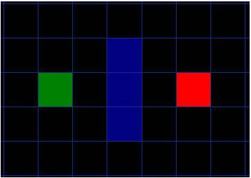

# 2D A星算法C++实现 #
## 步骤
1. 将寻路空间划分为`node`
	~~~
	struct Node 
	{
		TileType type;  //记录这个节点的类型
		int parRow;    	//用于记录父节点的行位置
		int parCol;    	//用于记录父节点的列位置
		int fn;
		int gn;  		//从起点到当前node的路径移动代价，一般表示距离
		int hn;  		//启发值(估算值)，启发值的计算方法有很多；这里只使用最简单的计算方法——曼哈顿算法；
				 		//曼哈顿计算方法：忽略地图中的一切，当做只有该节点和目标节点,让后去计算出走到终点（不允许对角线行走，不是不给，这样做的话会很麻烦，而且对算法效率提升的作用不大）所需要的步数；
				 		//启发值是对该节点走到终点需要代价的一个预估值；
	};
	~~~
	- 
2. 伪代码
	~~~
	while(True)
		nodeX = openTable中fn值最低的node
		if nodeX == None
			#找不到最短路径
		else
			if nodeX == targetNode
				#最短路径已找到
				break

		//条件
		//不在closeTable
		//可到达
		nodes = nodeX外一层满足以上条件的node

		for node in nodes
			#node的父亲指向nodeX
			#计算node.gn
			#计算node.hn
				##可采用曼哈顿方法：从当前node到targetNode的水平和垂直方格的数量总和 乘以 10
			node.fn = node.gn + node.hn

		for node in nodes
			if node not in openTable
				#直接放进openTable
			else
				if node.gn < nodeInOpenTable.gn
					#将nodeInopenTable的数据修改为node的数据
	~~~
## 参考资料
- [参考资料1](http://zhyt710.iteye.com/blog/739803)

